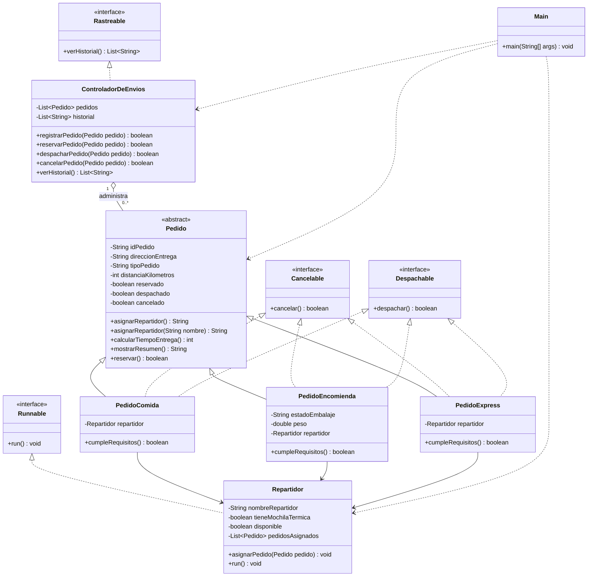

# SpeedFast

Proyecto desarrollado en Java para representar el funcionamiento de la empresa de reparto a domicilio SpeedFast.

El sistema permite gestionar pedidos de comida, encomiendas y compras express. Cada tipo de pedido posee reglas particulares para asignar un repartidor, calcular el tiempo estimado y determinar si puede reservarse, despacharse o cancelarse.

## Versión Semana 4

Esta versión conserva la estructura orientada a objetos de las semanas anteriores e incorpora programación concurrente para simular el trabajo simultáneo de varios repartidores.

El código correspondiente se encuentra en la carpeta `Semana 4`.

## Funcionalidades

- Registro de pedidos con identificadores únicos.
- Asignación automática y manual de repartidores.
- Reserva, despacho y cancelación de pedidos.
- Validación de requisitos particulares según el tipo de pedido.
- Cálculo personalizado del tiempo estimado de entrega.
- Historial general de operaciones.
- Clasificación de pedidos reservados, despachados y cancelados.
- Asignación de una lista de pedidos a cada repartidor.
- Ejecución paralela de los repartidores mediante `ExecutorService`.
- Simulación de entregas con pausas aleatorias y mensajes de avance.

## Clases principales

### Pedido

Clase abstracta que contiene los atributos y comportamientos comunes de todos los pedidos.

Incluye el método implementado `mostrarResumen()` y los métodos abstractos `calcularTiempoEntrega()`, `asignarRepartidor(String nombre)` y `reservar()`.

También conserva los estados `reservado`, `despachado` y `cancelado`.

### PedidoComida

Representa pedidos provenientes de restaurantes.

Comprueba que el repartidor tenga mochila térmica y se encuentre disponible.

### PedidoEncomienda

Representa el envío de documentos o paquetes.

Valida el peso, el estado del embalaje y la disponibilidad del repartidor.

### PedidoExpress

Representa pedidos de supermercado o farmacia.

Comprueba la disponibilidad inmediata del repartidor y permite mantener el pedido reservado a la espera de despacho.

### Repartidor

Representa al trabajador asociado al pedido e implementa la interfaz `Runnable`.

Almacena su nombre, disponibilidad, posesión de mochila térmica y una lista de pedidos asignados. Su método `run()` procesa las entregas secuencialmente.

### ControladorDeEnvios

Registra y administra los pedidos del sistema.

Se encarga de solicitar las operaciones de reserva, despacho y cancelación, además de conservar el historial y clasificar los pedidos según su estado.

## Interfaces

- `Despachable`: define la operación `despachar()`.
- `Cancelable`: define la operación `cancelar()`.
- `Rastreable`: define la consulta `verHistorial()`.

## Conceptos de POO aplicados

- Encapsulamiento mediante atributos privados, getters y setters.
- Herencia entre `Pedido` y sus clases derivadas.
- Abstracción mediante una clase y métodos abstractos.
- Sobrescritura de métodos con `@Override`.
- Sobrecarga del método `asignarRepartidor()`.
- Polimorfismo mediante referencias de tipo `Pedido`.
- Interfaces para separar responsabilidades.
- Asociación entre los pedidos y la clase Repartidor.
- Colecciones mediante `List` y `ArrayList`.
- Validaciones mediante `IllegalArgumentException`.
- Concurrencia mediante `Runnable` y `ExecutorService`.
- Pausas aleatorias con `Thread.sleep()` y manejo de `InterruptedException`.

## Diagrama de clases

El siguiente diagrama representa las clases, interfaces y relaciones principales del sistema SpeedFast.



## Aporte del diseño

La herencia permite reutilizar los atributos y métodos comunes definidos en `Pedido`, mientras que las clases hijas incorporan sus propias reglas de funcionamiento.

Las interfaces desacoplan las operaciones de cancelación, despacho y seguimiento, permitiendo incorporar nuevas clases con esas capacidades.

El controlador centraliza el registro y seguimiento de los pedidos. Esta separación de responsabilidades facilita la escalabilidad, reutilización y mantenibilidad del sistema.

## Cálculo de tiempos

| Tipo de pedido | Cálculo |
|---|---|
| Comida | 15 minutos base más 2 minutos por kilómetro |
| Encomienda | 20 minutos base más 1,5 minutos por kilómetro |
| Express | 10 minutos base y 5 adicionales si supera 5 kilómetros |

## Simulación concurrente

La clase `Main` crea tres repartidores y asigna dos pedidos a cada uno:

- Valentina entrega un pedido de comida y una encomienda.
- Camilo entrega un pedido express y un pedido de comida.
- Tomás entrega una encomienda y un pedido express.

Los repartidores se ejecutan en paralelo, mientras que cada uno procesa sus propios pedidos de manera secuencial. La aplicación espera que todos finalicen antes de mostrar el mensaje de término.

## Estructura de Semana 4

```text
Semana 4
`-- src
    |-- app
    |   `-- Main.java
    |-- gestor
    |   `-- ControladorDeEnvios.java
    |-- interfaces
    |   |-- Cancelable.java
    |   |-- Despachable.java
    |   `-- Rastreable.java
    `-- model
        |-- Pedido.java
        |-- PedidoComida.java
        |-- PedidoEncomienda.java
        |-- PedidoExpress.java
        `-- Repartidor.java
```

## Instrucciones de ejecución

1. Abrir la carpeta `Semana 4` en IntelliJ IDEA.
2. Verificar que el proyecto tenga configurado un JDK compatible.
3. Abrir la clase `Main`, ubicada en el paquete `app`.
4. Ejecutar el método `main()`.
5. Observar en consola el avance simultáneo de los repartidores.

## Tecnologías utilizadas

- Java JDK 8 o superior.
- IntelliJ IDEA.
- Git.
- GitHub.

## Autora

Nicole Ortega
